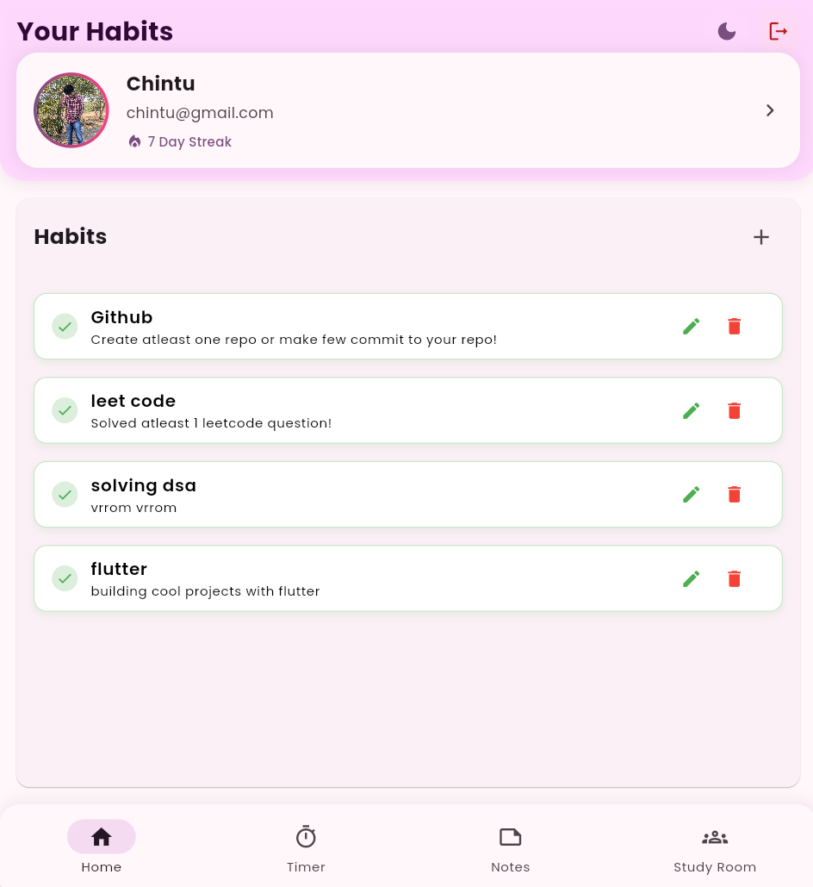
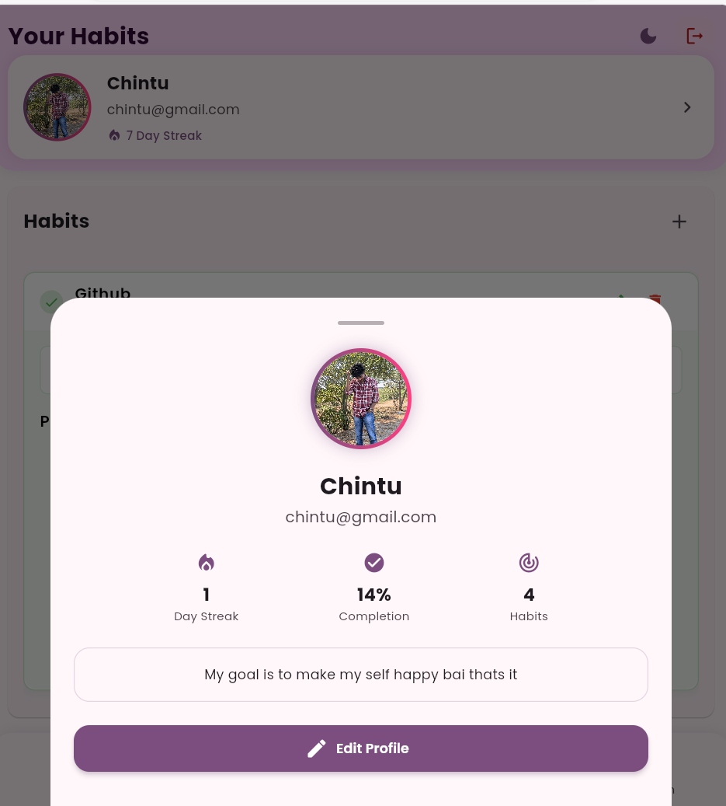
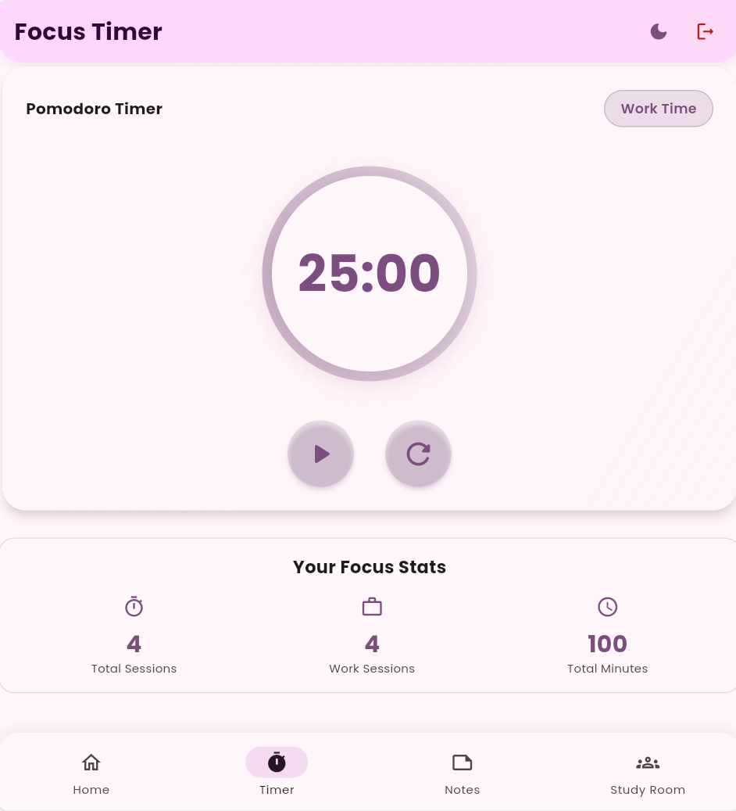

# ⚡ AtomicFlow - Build Better Habits

Transform your daily routines into lasting habits with AtomicFlow, a sleek and intuitive habit tracking app inspired by James Clear's "Atomic Habits". Break down your goals into small, manageable actions and watch your progress compound over time.

## 🌟 Core Features

- **Habit Stacking**: Link new habits to existing routines
- **Progress Tracking**: Visual habit completion streaks
- **Habit Analytics**: Track success rates and patterns
- **Minimalist Design**: Focus on what matters most
- **Pomodoro timer**: A timer with 25 mins work and 5 min break theme
- **Notes feature**: A noteing feature to write notes
- **A Study Room**: Study room is the mvp feature used build to bring a competetion in todays world where every indivudial can start their timer and in the end the one with highest time spending would rank first this would build a compitency among users

## 📱 Experience AtomicFlow

<div align="center">
  <table>
    <tr>
      <td><strong>Habit Dashboard</strong></td>
      <td><strong>Profile Management</strong></td>
      <td><strong>Features</strong></td>
    </tr>
    <tr>
      <td></td>
      <td></td>
      <td></td>
    </tr>
  </table>
</div>

## 🛠️ Built With

```yaml
Framework & Storage:
  - Flutter SDK
  - Firebase
  - cloudinary
  - Custom Animations

Architecture:
  - Clean Architecture
  - MVVM Pattern
  - Repository Pattern
```

## ⚡ Quick Start

1. Clone:
```bash
git clone https://github.com/Raghavendra-Reddy-Padala/AtomicFlow.git
```

2. Install:
```bash
cd AtomicFlow
flutter pub get
```

3. Run:
```bash
flutter run
```

## 📦 Key Dependencies

```yaml
dependencies:
  flutter:
    sdk: flutter
  cupertino_icons: ^1.0.8
  firebase_core: ^3.8.1
  firebase_auth: ^5.3.4
  cloud_firestore: ^5.5.1
  provider: ^6.1.2
  syncfusion_flutter_gauges: 24.1.47
  firebase_analytics: ^11.3.6
  flutter_slidable: ^3.1.1
  intl: 0.18.1
  flutter_heatmap_calendar: ^1.0.5
  shared_preferences: ^2.3.3
  rive: ^0.13.20
  flutter_riverpod: ^2.6.1
  cloudinary: ^1.2.0
  cloudinary_public: ^0.23.1
  image_picker: ^1.1.2
  google_fonts: ^6.2.1
  google_sign_in: ^6.2.2
  font_awesome_flutter: ^10.8.0
  loading_animation_widget: ^1.3.0
  cloudinary_dart: ^0.0.11
  cloudinary_sdk: ^5.0.0+1
  flutter_dotenv: ^5.2.1
  confetti: ^0.8.0

```

## 🎯 Upcoming Features

- Habit Categories
- Detailed Analytics
- Social Accountability
- Achievement Badges
- Theme Customization
- Data Export/Import

## 🤝 Contributing

1. Fork repository
2. Create feature branch
3. Commit changes
4. Push to branch
5. Create Pull Request


<p align="center">Created by Raghavendra Reddy Padala | Inspired by Atomic Habits</p>

```
Version: 1.0.0
Last Updated: January 2025
```
